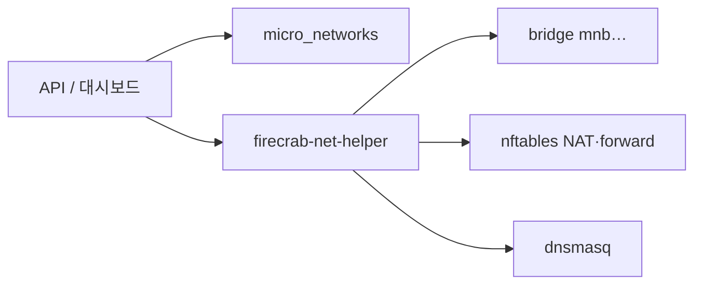

firecrab이 microVM에 붙이는 가상 네트워크를, 왜 하나로 두지 않고 여러 개로 쪼갰는지.

{/* truncate */}

## 한 줄로 말하면

MicroNetwork는 firecrab에서 사용자가 직접 만드는 가상 네트워크다.  
bridge 하나, subnet 하나, 그 위의 DHCP·NAT·방화벽을 한 묶음으로 다룬다.  
AWS로 치면 **VPC + Subnet**을 합쳐 놓은 것에 가깝다.

VM을 띄울 때 “어느 네트워크에 넣을지”를 고르면, 그 VM은 그 네트워크의 IP를 받고,  
다른 MicroNetwork의 VM과는 기본적으로 통신하지 못한다.

## 원래는 네트워크가 하나뿐이었다

초기 firecrab 네트워크는 단순했다.

- bridge: `fcbr0`
- subnet: `172.30.0.0/24`
- gateway 하나, DHCP 하나, NAT 하나

동작은 잘 했다. 다만 그 “하나뿐인 네트워크”가 코드 곳곳에 하드코딩되어 있었다.  
IPAM, bridge, firewall, NAT, DHCP — 대략 다섯 군데에 같은 가정이 흩어져 있었다.

문제는 기능이 부족해서가 아니라, **가정 자체가 하나**였다는 점이다.

- prod와 stage를 같은 L2에 두고 싶지 않다
- 어떤 VM은 인터넷이 필요하고, 어떤 VM은 내부만 통하면 된다
- 한 팀이 쓰는 대역과 다른 실험 대역을 분리하고 싶다

클라우드에서는 당연한 요구인데, 호스트 한 대 위의 microVM 컨트롤 플레인에서는  
아직 “기본 bridge 하나”가 전부였다.  
그래서 한 일은 새 서비스를 하나 더 만드는 게 아니라,  
**그 다섯 곳을 네트워크별로 파라미터화**하는 것이었다.

## MicroNetwork가 실제로 소유하는 것

MicroNetwork 하나를 만들면 firecrab은 대략 이런 것을 함께 준비한다.

| 구성 요소 | 역할 |
| --- | --- |
| subnet CIDR | 예: `172.31.0.0/24` |
| bridge | `mnb` + id 해시 형태의 인터페이스 |
| gateway | 보통 그 서브넷의 `.1` |
| DHCP 범위 | 그 bridge 위에서 lease 배분 |
| NAT / 방화벽 규칙 | 외부 통신과 네트워크 간 차단 |
| 소속 VM | 생성 시 이 네트워크를 선택한 VM들 |

계층은 일부러 1단으로 유지했다.

```text
MicroNetwork
 └── subnet 하나
      └── bridge 하나
           └── TAP들 (VM NIC)
```

“MicroNetwork = 격리 경계, Subnet = CIDR 조각”처럼 2계층으로 나누는 설계도 검토했지만,  
단일 호스트에서는 한 네트워크에 subnet을 여러 개 둘 동기가 아직 약했다.  
분리하면 VRF, UI, 스키마까지 한꺼번에 커진다.  
지금은 **한 네트워크 = 한 서브넷 = 한 bridge**가 가장 정직한 모델이다.

:::note[기존 동작]

MicroNetwork를 고르지 않은 VM은 예전과 같이 기본 네트워크(`fcbr0`, `172.30.0.0/24`)에 붙는다.  
기존 동작은 깨지 않는다.

:::

## AWS 콘솔 감으로 읽기

cloud 경험이 있으면 이 표만 보면 거의 끝이다.

| firecrab | AWS에 대응하면 |
| --- | --- |
| MicroNetwork | VPC + Subnet (통합) |
| bridge + gateway | Subnet 뒤의 암묵적 라우터 |
| DHCP 범위 | DHCP option set |
| NAT | NAT Gateway |
| 인터넷 on/off | Internet Gateway attach / detach |
| VM ↔ MicroNetwork | EC2 ↔ VPC/Subnet |
| MicroNetwork 간 차단 | VPC peering 없는 기본 격리 |
| lease 있는 네트워크 삭제 거부 | ENI가 남은 subnet 삭제 거부 |

즉, AWS 콘솔에서 VPC를 만들고 인스턴스를 그 안에 넣는 흐름을,  
자기 Linux 호스트 위에서 다시 만든 셈이다.  
다만 multi-AZ, peering, route table 수준의 복잡도는 아직 의도적으로 빼 두었다.  
단일 호스트 사설 클라우드에 필요한 만큼만.

## 만들면 호스트에서 무슨 일이 일어나나

대시보드나 API로 MicroNetwork를 만들면 흐름은 대략 이렇다.

1. API가 CIDR을 검증하고, 기존 네트워크·기본 네트워크와 겹치지 않는지 확인한다
2. `micro_networks` 테이블에 레코드를 넣는다
3. `firecrab-net-helper`가 bridge를 만들고 gateway 주소를 붙인다
4. nftables에 네트워크별 NAT·forward 규칙을 다시 깐다
5. dnsmasq 설정에 그 네트워크의 `interface=` / `dhcp-range=`를 넣고 재시작한다

VM을 그 네트워크에 소속시키면:

1. IPAM이 그 네트워크 CIDR 안에서 lease(IP+MAC)를 고른다
2. start 시 TAP을 만들고, 그 MicroNetwork의 bridge에 attach한다
3. guest는 그 bridge의 DHCP에서 주소를 받는다

그래서 prod 네트워크 VM은 `172.31.0.x`, stage 네트워크 VM은 `172.32.0.x`처럼  
네트워크마다 다른 주소 공간을 갖게 된다.



## 설계에서 특히 신경 쓴 세 가지

### 1. 인터페이스 이름은 문자열이 아니라 id에서 유도한다

bridge 이름은 API가 마음대로 넘기지 않는다.  
helper가 MicroNetwork id의 해시로 `mnb…` 형태를 직접 만든다.

이유는 단순하다. 문자열이 `ip link`나 nftables 인자로 들어가면,  
검증 실수 한 번이 곧 호스트 네트워크 사고로 이어질 수 있다.  
API가 helper에 넘기는 핵심 값은 gateway와 prefix 숫자 쪽이고,  
이름·네트워크 주소 같은 것은 id와 CIDR에서 결정론적으로 다시 계산한다.

### 2. 특권은 helper만 갖는다

`firecrab-api` 자체는 비특권 프로세스다.  
bridge, TAP, firewall, DHCP처럼 root가 필요한 일은  
Unix 소켓 너머의 `firecrab-net-helper`만 한다.

그리고 helper는 API가 이미 검사한 값도 자기 기준으로 다시 본다.  
API의 CIDR 허용 범위와 helper의 prefix 재검증이 따로 있는 이유다.  
이게 firecrab에서 말하는 **신뢰 경계**다.

### 3. “재적용”을 전제로 둔다

호스트를 재부팅하거나 bridge를 누가 지워도,  
daemon 시작 시(그리고 VM 시작 시) 네트워크 상태를 다시 맞춘다.

- 기본 bridge
- MicroNetwork별 bridge
- 방화벽
- DHCP

한 번에 되살린다. “DB에는 있는데 호스트에는 없는” 상태를 오래 방치하지 않겠다는 선택이다.

다만 전역 방화벽 적용은 테이블을 flush한다.  
그래서 적용 직후 실행 중인 VM의 개별 정책을 다시 설치한다.  
안 하면 네트워크 하나 만들고 토글 한 번에,  
돌고 있던 VM 전부가 조용히 외부 통신을 잃을 수 있다.

## 인터넷 on/off — 가장 체감되는 스위치

MicroNetwork마다 `internet_enabled`가 있다.

| 상태 | 동작 |
| --- | --- |
| **on** | 그 서브넷 트래픽이 NAT(masquerade)를 타고 호스트 uplink로 나간다 |
| **off** | masquerade 규칙이 빠지고, 새 외부 흐름은 drop된다 |

중요한 점은 **내부는 그대로**라는 것이다.  
bridge, 주소, DHCP, 게이트웨이 ping은 살아 있다.  
AWS로 치면 Internet Gateway만 떼어 낸 상태에 가깝다.

토글이 helper 적용에 실패하면 저장값도 되돌린다.  
호스트는 아직 막고 있지 않은데 UI만 “차단됨”으로 보이는 거짓말 상태를 만들지 않기 위해서다.

## 격리는 어디까지 오나

현재 네트워크 간 차단의 중심은 nftables 규칙이다.

- 같은 MicroNetwork 안 east-west는 bridge 쪽 테이블이 담당
- 서로 다른 MicroNetwork 서브넷으로 가는 라우팅은 deny 목록으로 막음

즉 “다른 VPC와 기본적으로 안 통한다” 수준까지는 이미 있다.  
다만 이건 아직 **규칙 기반 격리**다. 규칙이 빠지면 구멍이 날 수 있다.  
그래서 다음 단계로 VRF 같은 커널 수준 분리를 남겨 둔 상태다.

아직 범위 밖인 것들도 분명하다.

- MicroNetwork 간 peering
- 네트워크별 전용 uplink
- 호스트 UFW 같은 외부 방화벽과의 깊은 연동

:::warning[UFW 함정]

UFW를 쓰는 호스트에서는 새 `mnb…` bridge마다 DHCP/DNS 허용을 따로 열어 줘야 한다.  
기본 네트워크(`fcbr0`)에만 열어 두면,  
MicroNetwork에 넣은 VM만 `no-ipv4-address`로 실패하는 함정이 있다.

:::

## 사용 장면

MicroNetwork가 있으면 이런 배치가 자연스러워진다.

**환경 분리**  
prod / stage / lab을 서로 다른 CIDR·bridge에 두고, 사고 반경을 네트워크 단위로 자른다.

**인터넷 posture 분리**  
외부 패키지 설치가 필요한 빌드 VM은 internet on,  
민감한 데이터만 다루는 내부 서비스 VM은 internet off.

**실험 샌드박스**  
겹치지 않는 실험 대역을 만들고, 끝나면 네트워크째로 지운다.  
다만 VM lease가 남아 있으면 삭제를 거부한다.  
“아직 누가 붙어 있는데 네트워크를 뽑지 마”라는 가드다.

대시보드에서는 헤더의 MicroNetwork 모달로 목록·생성·삭제·인터넷 토글·상세를 보고,  
VM 생성 폼에서 소속 네트워크를 고르면 된다. API만 써도 된다.

```sh
# 네트워크 만들기
curl -s -X POST localhost:3000/api/micro-networks \
  -H 'content-type: application/json' \
  -d '{"name":"prod","subnetCidr":"172.31.0.0/24"}'

# 인터넷 차단
curl -s -X PATCH localhost:3000/api/micro-networks/$ID \
  -H 'content-type: application/json' \
  -d '{"internetEnabled":false}'
```

## 이 작업이 알려 준 것

MicroNetwork는 “네트워크 기능 추가”라기보다,  
**단일 네트워크 가정을 리소스로 승격한 작업**에 가깝다.

- 하드코딩된 상수를 파라미터로 바꾸고
- 그 파라미터를 DB 리소스로 저장하고
- helper가 호스트 상태를 멱등하게 맞추고
- UI/API에서 사용자가 고를 수 있게 한다

클라우드 제품에서 VPC가 커 보이는 이유는 기능 목록이 길어서가 아니다.  
격리 단위를 사용자가 소유하게 만드는 순간,  
주소 공간·DHCP·NAT·방화벽·삭제 가드·재적용 모두가 그 단위를 따라가야 하기 때문이다.

firecrab의 MicroNetwork는 그 최소 단위를,  
호스트 한 대와 Firecracker microVM 위에 올린 버전이다.  
화려하지는 않다.  
대신 “VM을 어디에 붙일지”를 코드 상수가 아니라 **사용자가 고르는 리소스**로 바꿔 준다.

## 다음에 올 것

3주차 범위에서는 “여러 네트워크를 만들고, VM을 소속시키고, 인터넷을 켜고 끄고, 재적용한다”까지 닫혔다.  
남은 이야기는 격리의 깊이 쪽이다.

- **VRF**: 규칙이 아니라 커널 라우팅 도메인으로 네트워크를 나누기
- **네트워크별 uplink**: 지금은 호스트 기본 경로 하나를 공유
- **호스트 방화벽 연동**: 자기 소유가 아닌 firewall을 어디까지 건드릴지

VPC를 흉내 내는 일이 목적이 아니다.  
사설 microVM 클라우드에서 네트워크를 안전한 기본 단위로 만드는 일이 목적이다.  
MicroNetwork는 그 첫 번째, 그리고 가장 중요한 조각이다.
