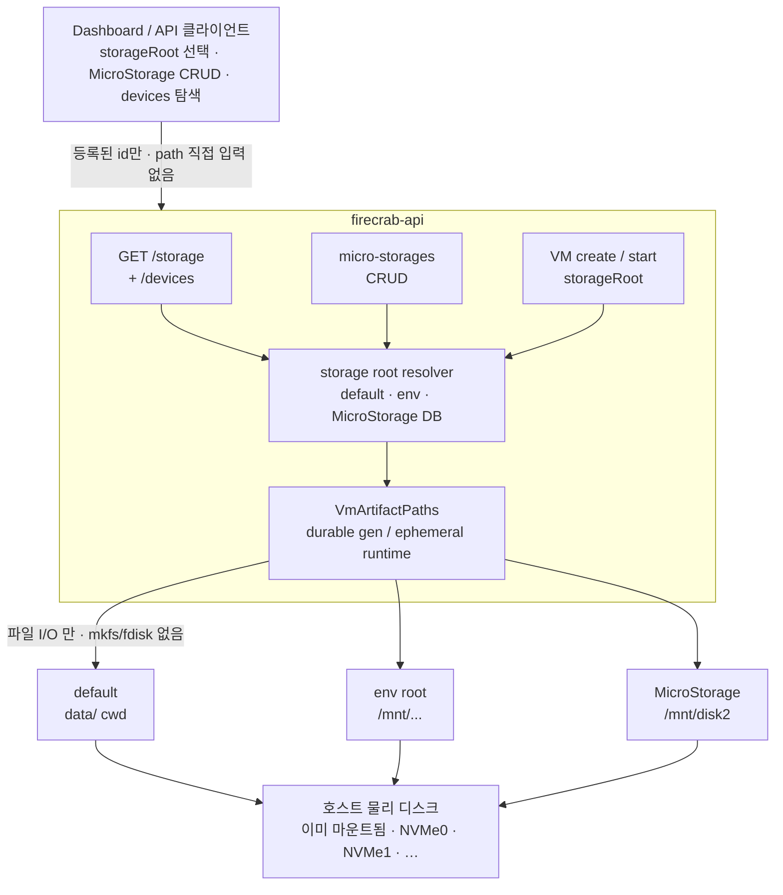
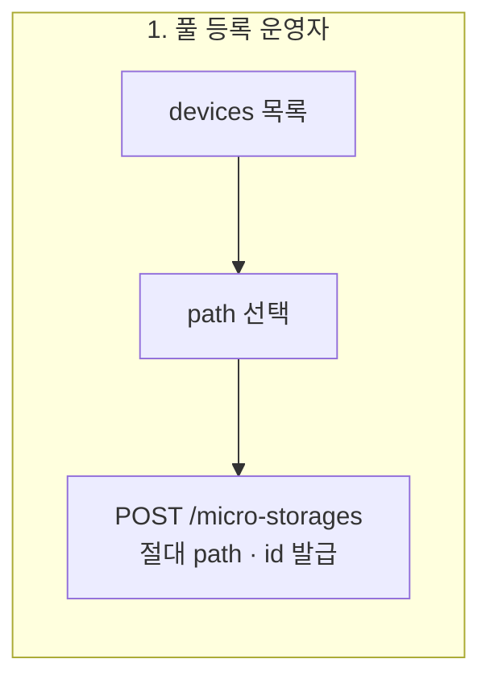
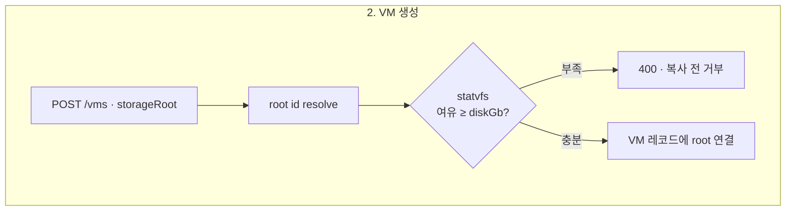
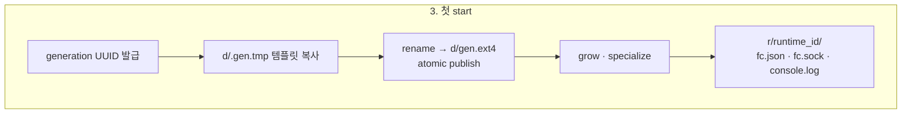
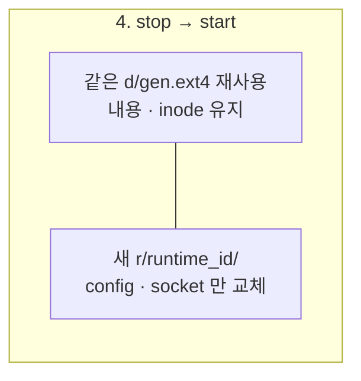
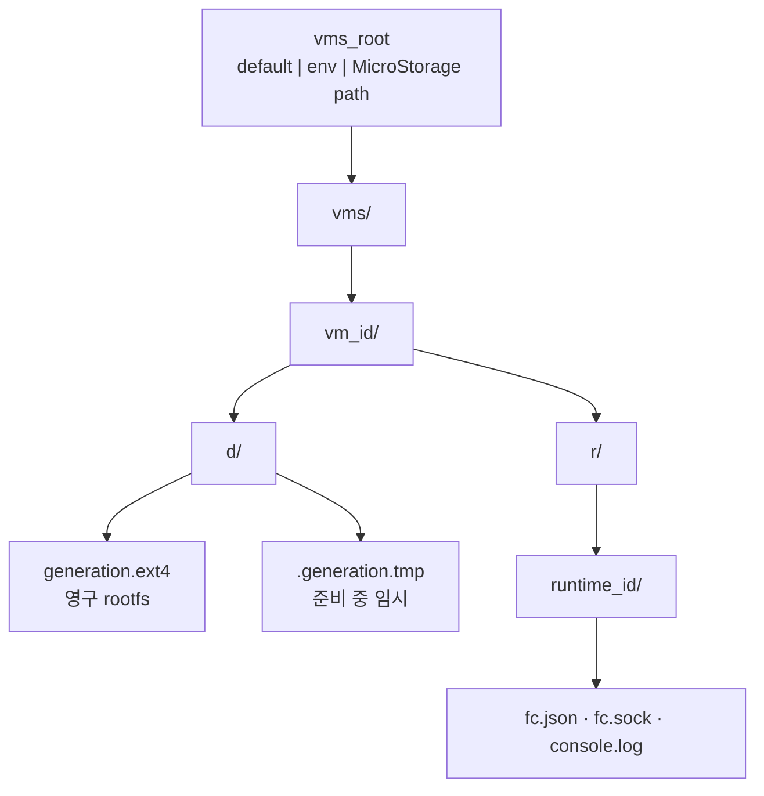

MicroNetwork가 “어느 네트워크에 붙일지”라면, MicroStorage는 **어느 물리 디스크에 VM 디스크를 둘지**입니다.  
AWS로 비유하면 EBS 풀·볼륨 위치를 고르는 일에 가깝고, 파티션을 새로 만들어 주는 서비스는 아닙니다.

{/* truncate */}

## 왜 나왔나

동시에 여러 VM을 켜면 디스크 I/O가 한 장치에 몰립니다.

1. 템플릿 rootfs를 VM 전용 파일로 복사
2. 요청한 `diskGb`까지 늘리기 (`set_len` + `resize2fs`)

VM 한 대만 보면 수 GB 순차 쓰기라 크게 막히지 않습니다.  
문제는 같은 물리 디스크(`data/vms/` 한곳)에 여러 대가 동시에 붙을 때입니다.

- `iostat`에서 그 장치 `%util` ≈ 100%
- `w_await`가 수백 ms로 튐
- 대시보드에는 “디스크 준비” 단계에서 오래 멈춘 것처럼 보임

:::important[2026-07-21 실측]

NVMe 하드웨어 문제가 아니라, **한 큐에 I/O가 몰린 것**이었습니다.

:::

네트워크를 MicroNetwork로 나눈 것처럼, **디스크 경로도 나눌 수 있어야** 했습니다.

## 이 글에서 다루는 것

디스크를 나누려면 아래 세 가지가 함께 필요합니다. 본문도 이 순서입니다.

1. **어디에 둘지** — VM을 만들 때 어느 디스크(storage root)를 고를지
2. **풀을 어떻게 둘지** — 마운트된 경로에 이름을 붙이고, 필요할 때 다시 고를지 (MicroStorage)
3. **파일이 어떻게 남는지** — stop 뒤에도 rootfs는 유지하고, start마다 config·socket만 새로 둘지 (generation / runtime)

## 아키텍처

MicroStorage는 파티션을 만들지 않습니다. 호스트에 **이미 마운트된 경로**에 이름을 붙이고, 그 위에 VM 디스크 파일을 나누어 둡니다.

### 전체 구조



### 요청 흐름









### 디스크 위 레이아웃

한 VM이 한 storage root에 배정된 뒤, 호스트 경로는 대략 이렇게 됩니다.



| 구분 | 경로 | 수명 |
| --- | --- | --- |
| 영구 (durable) | `d/{generation}.ext4` | stop / start 후에도 유지 |
| 일시 (ephemeral) | `r/{runtime}/…` | start마다 새로 생성 |
| 신뢰 경계 | API에는 **root id**만 | 절대 path는 서버가 해석 |

I/O가 갈라지는 지점도 여기입니다. VM A를 `/mnt/disk2/vms/…`에, VM B를 `data/vms/…`에 두면 **물리 장치 큐가 둘로 나뉩니다.**

## 1. VM 생성 시 물리 디스크 선택

생성 시점에는 등록된 **storage root id**만 고를 수 있습니다. 클라이언트가 임의 path를 넘기지 않습니다.

### storage root 출처

| 종류 | 출처 | 비고 |
| --- | --- | --- |
| `default` | cwd 기준 `data/` | 기존 레이아웃 |
| env | `FIRECRAB_STORAGE_ROOTS=id=path:id2=path2` | 배포·고정 경로 |
| MicroStorage | DB에 이름 + 절대경로 | API / UI로 등록 |

선택 목록은 세 출처를 합친 결과입니다.

```http
GET /api/storage
```

```json
[
  {
    "id": "default",
    "name": "default",
    "path": "data",
    "availableGib": 120,
    "totalGib": 500,
    "kind": "default"
  },
  {
    "id": "a1b2…",
    "name": "nvme1",
    "path": "/mnt/disk2",
    "availableGib": 800,
    "totalGib": 1000,
    "kind": "micro_storage"
  }
]
```

### 생성 요청

```json
POST /api/vms
{
  "name": "worker-1",
  "template": "alpine-3.24",
  "cpu": 1,
  "ram": 512,
  "diskGb": 2,
  "storageRoot": "<default | env-id | micro-storage-uuid>"
}
```

- `storageRoot`를 빼면 목록의 첫 root (`default`, 또는 env의 첫 id)
- id가 없거나 여유 공간이 `diskGb`보다 작으면, rootfs 복사 **전에** `400` (`storageRoot`)
- 실제 파일 위치: `{root path}/vms/{vm-id}/…` (3절 generation 참고)

:::note[호환]

풀을 지정하지 않으면 예전과 같이 `data/vms/{id}/`를 씁니다. 기존 스크립트는 그대로 동작합니다.

:::

## 2. MicroStorage 서비스

호스트에 **이미 마운트된** 디렉터리에 이름을 붙인 영구 풀입니다.  
등록·조회·삭제와, 이미 만든 VM에 풀을 다시 지정하는 기능이 있습니다.

### API

| 메서드 | 경로 | 역할 |
| --- | --- | --- |
| `GET` | `/api/micro-storages` | 풀 목록 + 여유 공간 |
| `POST` | `/api/micro-storages` | `{ "name", "path" }` 등록 (절대 경로) |
| `GET` | `/api/micro-storages/{id}` | 상세 + 이 풀을 쓰는 VM |
| `DELETE` | `/api/micro-storages/{id}` | 삭제 (VM이 있으면 **409**) |
| `PUT` | `/api/vms/{id}/storage` | 수동 재할당 `{ "storageRoot" }` |

### 재할당 조건

- VM 상태: `created` / `stopped` / `error`
- **rootfs가 이미 있으면 409** — 수 GB 디스크를 백그라운드에서 옮기지 않음
- UI: 헤더 **MicroStorage** 모달, 생성 폼, VM 상세 편집

### 파티션은 탐색만

```http
GET /api/storage/devices
```

| 하는 일 | 하지 않는 일 |
| --- | --- |
| 마운트된 파티션·파일시스템 **목록** | `fdisk` / 파티션 테이블 생성 |
| path를 풀로 **등록** | `mkfs`, 포맷, 마운트 자체 |
| 여유 공간 표시 | 게스트 안 파티션 나누기 |

`/proc/mounts`(가능하면 `lsblk`)에서 실디스크 마운트만 골라 줍니다. UI에서 행을 고르면 path가 채워집니다.

:::important[신뢰 경계]

API는 보통 비특권 유저로 돌아갑니다. 파티션 조작은 root가 하는 파괴적 작업입니다.  
클라이언트가 임의 path를 넘기면 호스트 전역 쓰기가 되므로, **등록된 id만** 받습니다.

:::

### 쓰는 순서

```text
1. (호스트) 두 번째 디스크를 /mnt/disk2 에 마운트
2. 대시보드 MicroStorage → name: disk2, path: /mnt/disk2
   또는 devices 표에서 선택
3. VM 생성 시 저장 위치 = disk2
4. 여러 대를 default / disk2 에 나눠 동시에 시작
5. iostat 으로 장치 util 이 나뉘는지 확인
```

env만으로도 같은 효과를 낼 수 있습니다.

```sh
export FIRECRAB_STORAGE_ROOTS="local=data:fast=/mnt/disk2"
```

## 3. disk generation · artifact ledger

**디스크 내용**과 **이번 start용 런타임 파일**을 나눕니다.  
stop 후 다시 start해도 rootfs는 그대로 두고, config와 socket만 새로 만듭니다.

### 경로 규칙

호스트 절대 경로는 DB에 넣지 않습니다. 설정된 vms root 아래에서만 경로를 만듭니다.

```text
{vms_root}/{vm_id}/
  d/{generation}.ext4     # 영구 writable rootfs
  d/.{generation}.tmp     # atomic publish 용 임시 파일
  r/{runtime}/
    fc.json               # 이번 start Firecracker config
    fc.sock               # API socket
    console.log           # guest console
```

- 짧은 이름(`d`, `r`, `fc.sock`) — nested UUID 아래 AF_UNIX 경로 길이(~108B)를 지키기 위함
- DB: `vms.disk_generation`, `vms.last_runtime_id` (UUID text)
- 구현: `firecrab-api/src/artifacts.rs`의 `VmArtifactPaths`

:::note[경로 이름]

문서·메모에 나오는 `disks/{gen}.ext4`와 같은 개념입니다. 실제 트리는 `d/{gen}.ext4`와 `r/{runtime}/`입니다.

:::

### 시점별 동작

| 시점 | 동작 |
| --- | --- |
| 첫 start | generation UUID 할당 → 임시 복사 → rename → grow → specialize · runtime 디렉터리 생성 |
| stop → start | **같은** generation 파일 재사용 (inode·내용 유지) · **새** runtime_id 디렉터리 |
| prepare 실패 | `.tmp`와 미완성 final 제거 |
| delete | 해당 VM artifact 트리 전체 삭제 |

generation UUID는 이후 **snapshot lineage**를 붙이기 위한 자리이기도 합니다.  
풀별 multi-gen retention UI는 아직 없습니다.

## 설계 원칙 (MicroNetwork와 같은 방향)

| 원칙 | 내용 |
| --- | --- |
| 기본값은 그대로 | 미지정 시 `data/vms/{id}/` |
| 생성 시 path 자유 입력 없음 | 등록된 id만 |
| 등록은 운영자 작업 | MicroStorage CRUD 또는 env |
| 용량은 생성·할당 시점에 확인 | `statvfs`로 복사 전 거부 |
| 파티션 생성은 하지 않음 | 마운트된 것만 찾아 등록 |
| 영구 vs 일시 | generation rootfs는 유지, runtime은 start마다 |

## API 요약

| 용도 | API |
| --- | --- |
| 선택 목록 (생성·할당 폼) | `GET /api/storage` |
| 마운트 파티션 탐색 | `GET /api/storage/devices` |
| 풀 관리 | `GET`/`POST` `/api/micro-storages`, `GET`/`DELETE` `…/{id}` |
| 생성 시 지정 | `POST /api/vms` · `storageRoot` |
| 수동 재할당 | `PUT /api/vms/{id}/storage` |

## 아직 하지 않은 것

- 이미 있는 rootfs를 다른 풀로 복사·이전 (지금은 디스크가 생기면 재할당을 거절)
- 풀별 쿼터·예약
- multi-gen retention UI (snapshot lineage)
- 게스트 내부 디스크 파티션 (별도 영역)

## 정리

동시에 여러 MicroVM을 돌리는 호스트에서, 병목은 코드만이 아니라 **한 디스크**일 수 있습니다.

- **풀**로 물리 위치를 나누고
- **생성·재할당**으로 어디에 둘지 고르고
- **generation / runtime**으로 영구 디스크와 한 번의 start를 갈라 둡니다

MicroStorage가 지금 하는 일이 이것입니다.
