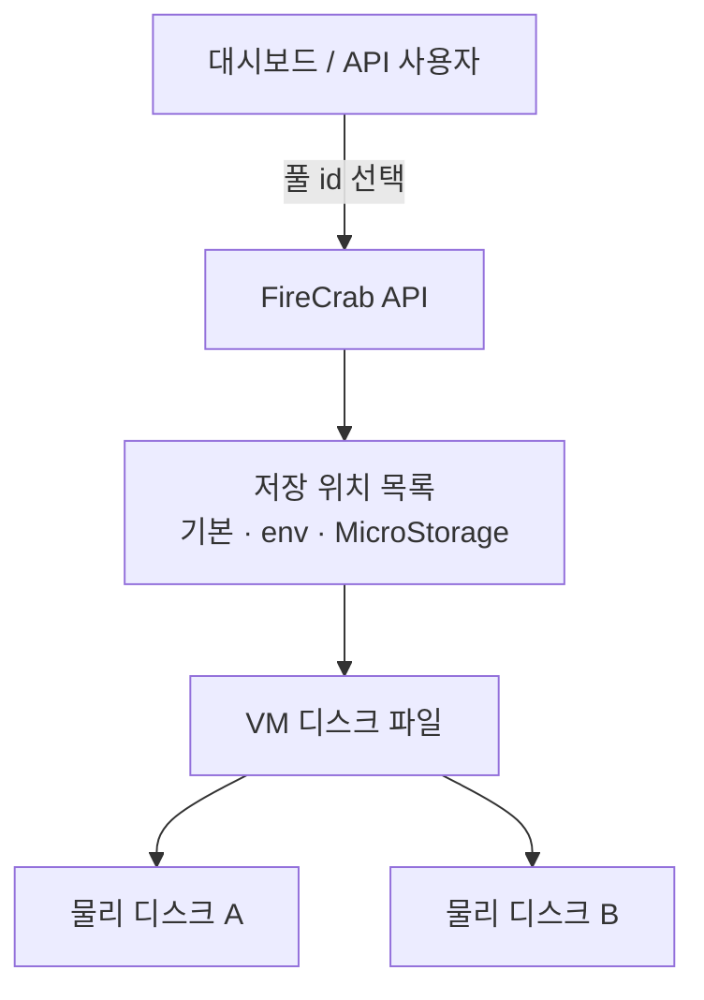

동시에 여러 MicroVM을 켜면, 네트워크만 나누면 끝나는 게 아닙니다.  
**디스크 파일도 어느 물리 디스크에 둘지** 나눌 수 있어야 합니다. FireCrab에서는 그 역할을 **MicroStorage**가 맡습니다.

AWS로 비유하면 EBS 볼륨을 “어느 쪽 스토리지에 둘지” 고르는 일에 가깝습니다.  
파티션을 새로 만들거나 포맷해 주는 서비스는 아닙니다.

{/* truncate */}

## 문제

FireCrab에서 VM을 처음 켤 때는 대략 이런 일이 일어납니다.

1. 템플릿 디스크 이미지를 VM 전용 파일로 복사
2. 요청한 용량까지 늘리기

한 대만 보면 수 GB 순차 쓰기라 큰 문제가 아닙니다.  
같은 물리 디스크 한곳에 여러 대가 동시에 붙으면 이야기가 달라집니다.

- 그 디스크 사용률이 거의 100%에 붙고
- 쓰기 대기 시간이 크게 늘고
- UI에는 “디스크 준비”에서 멈춘 것처럼 보입니다

:::important[2026-07-21 실측]

NVMe가 느린 게 아니라, **한 디스크 큐에 일이 몰린 것**이었습니다.

:::

네트워크를 나눈 것처럼, 디스크도 “어느 장치에 파일을 둘지” 고를 수 있어야 했습니다.

## MicroStorage가 하는 일

한 줄로 말하면 이렇습니다.

> 호스트에 **이미 마운트된 폴더**에 이름을 붙이고,  
> VM 디스크 파일을 그 폴더 아래에 두도록 고르게 합니다.

| 하는 일 | 하지 않는 일 |
| --- | --- |
| 저장 위치에 이름(풀)을 붙임 | 파티션 생성 (`fdisk`) |
| VM 생성·재할당 때 풀을 고름 | 포맷 (`mkfs`) |
| 여유 공간 확인 후 부족하면 거절 | 마운트 자체 |
| 이미 마운트된 디스크 목록 보여 줌 | 게스트 OS 안 파티션 나누기 |

운영 흐름은 단순합니다.

1. 호스트에서 디스크를 마운트한다 (예: `/mnt/disk2`)
2. FireCrab에 풀로 등록한다 (이름 + 경로)
3. VM을 만들 때 그 풀을 고른다
4. 여러 VM을 서로 다른 풀에 나눠 동시에 켠다

```sh
# 대시보드 없이 환경 변수만으로도 가능
export FIRECRAB_STORAGE_ROOTS="local=data:fast=/mnt/disk2"
```

## 저장 위치는 어디서 오나

VM이 쓸 수 있는 저장 위치는 세 곳에서 모입니다.

| 종류 | 설명 |
| --- | --- |
| **기본 (`default`)** | 예전과 같은 `data/` 아래. 풀을 안 고르면 여기로 갑니다. |
| **환경 변수** | `FIRECRAB_STORAGE_ROOTS`로 고정 경로를 미리 넣습니다. |
| **MicroStorage** | 대시보드·API로 이름과 절대 경로를 등록합니다. |

생성 화면·할당 화면에는 위 목록이 하나로 합쳐져 나옵니다.  
사용자는 **경로 문자열을 직접 치지 않고**, 등록된 이름(id)만 고릅니다.

:::note[기존 동작]

풀을 지정하지 않으면 예전과 같이 `data/vms/{id}/`를 씁니다.  
기존 스크립트·배포를 깨지 않기 위한 기본값입니다.

:::

## 왜 path를 직접 받지 않나

클라이언트가 `/etc`나 임의 경로를 넘기면 호스트 전역 쓰기가 됩니다.  
그래서 경계는 이렇게 잡았습니다.

- **운영자**: 마운트된 경로를 풀로 등록
- **사용자·스크립트**: 등록된 풀 id만 선택
- **API**: 풀 id → 서버가 실제 경로로 해석

파티션을 API로 만들지 않는 이유도 같습니다.  
디스크 나누기·포맷은 root 권한의 OS 작업이고, FireCrab은 그 **위에 이름 붙인 폴더**만 관리합니다.

## 구조 (개념)



동시 시작 때 효과를 내려면, VM을 **서로 다른 물리 디스크가 마운트된 풀**에 나누면 됩니다.

```text
VM A → 풀 "fast"  → /mnt/disk2/...   (NVMe 1)
VM B → 풀 "local" → data/...         (NVMe 0)
```

## VM 디스크 파일이 어떻게 유지되나

풀을 고르는 것만으로는 부족합니다.  
**stop 후 start**할 때 디스크 내용이 사라지면 안 되고, 실행용 설정 파일은 매번 새로 만들어도 됩니다.

그래서 역할이 둘로 나뉩니다.

| | 영구 디스크 | 실행용 파일 |
| --- | --- | --- |
| 예 | rootfs 이미지 | Firecracker 설정, 소켓, 콘솔 로그 |
| stop → start | **그대로 유지** | **새로 생성** |
| 목적 | VM 데이터·파일시스템 보존 | 이번 실행 세션만 사용 |

첫 시작 때만 템플릿을 복사해 영구 디스크를 만들고,  
이후 재시작에서는 그 파일을 다시 씁니다.  
이미 디스크가 있는 VM은 “다른 풀로 조용히 옮기기”를 하지 않습니다. 수 GB 파일을 백그라운드에서 옮기면 운영 사고가 되기 쉽습니다.

## 대시보드·API에서

| 하고 싶은 일 | 어디서 |
| --- | --- |
| 풀 등록 / 목록 / 삭제 | 헤더 **MicroStorage**, 또는 `/api/micro-storages` |
| 마운트된 디스크 고르기 | 풀 등록 UI의 devices 목록, 또는 `/api/storage/devices` |
| 생성 시 저장 위치 선택 | VM 생성 폼, `POST /api/vms`의 `storageRoot` |
| 아직 디스크 없는 VM 옮기기 | VM 상세 편집, `PUT /api/vms/{id}/storage` |
| 선택 가능한 전체 목록 | `GET /api/storage` |

여유 공간이 요청 용량보다 작으면, 큰 파일을 복사하기 **전에** 거절합니다.

## 아직 없는 것

- 이미 만들어진 rootfs를 다른 풀로 복사·이전
- 풀별 용량 쿼터·예약
- 세대별 스냅샷 UI
- 게스트 안에서 파티션 나누기

## 정리

MicroStorage는 “디스크를 만들어 주는 클라우드 스토리지”가 아니라,  
**이미 있는 물리 디스크를 이름 붙인 풀로 나누어 쓰는 장치**입니다.

1. 호스트에서 디스크를 마운트하고  
2. FireCrab에 풀로 등록한 뒤  
3. VM마다 풀을 고르면  

동시에 여러 MicroVM을 켤 때 I/O가 한 장치에만 몰리지 않게 할 수 있습니다.
