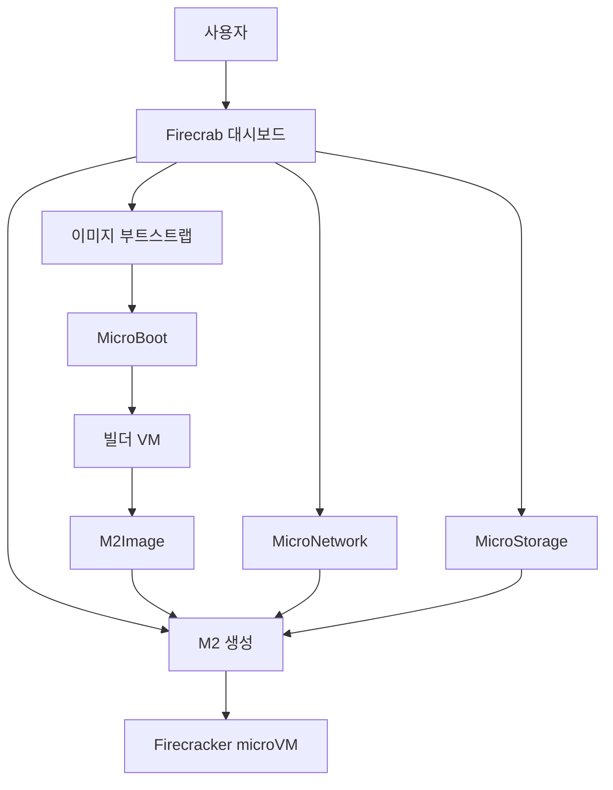

Firecrab에 **M2** 기능이 추가되었습니다. M2는 Firecrab에서 실행하는 가상 머신의 단위로, AWS Firecracker 기반의 microVM을 생성하고 관리할 수 있습니다.

{/* truncate */}

## 구성 흐름

## M2란?

M2는 **MicroMachine**의 줄임말입니다. Firecrab에서는 일반적으로 VM이라고도 부르며, 애플리케이션과 서비스를 실행하는 독립된 컴퓨팅 환경입니다.

각 M2는 선택한 M2Image, CPU, 메모리, 디스크, MicroNetwork 설정을 바탕으로 생성됩니다.

## 왜 M2가 필요한가요?

일반적인 가상 머신은 운영체제와 리소스를 독립적으로 제공하지만, 운영 환경에 따라 더 가볍고 단순한 실행 단위가 필요할 수 있습니다.

M2는 Firecracker microVM을 기반으로 VM을 생성하고 실행합니다. 이를 통해 Firecrab 안에서 이미지, 네트워크, 스토리지를 조합해 필요한 실행 환경을 구성할 수 있습니다.

## 어떻게 동작하나요?

M2를 생성하면 Firecrab이 선택한 M2Image를 바탕으로 VM 전용 rootfs를 준비하고, CPU·메모리·디스크·네트워크 설정을 적용합니다.

VM을 시작하면 Firecracker 프로세스가 실행되고, MicroNetwork를 통해 IP 주소를 할당받습니다. 실행 상태와 시작 과정은 대시보드에서 확인할 수 있으며, 실행 중인 M2에는 시리얼 콘솔로 접속할 수 있습니다.

## 사용 방법

1. 사용할 M2Image를 준비합니다.
2. VM을 연결할 MicroNetwork를 생성합니다.
3. 대시보드에서 VM 이름, 이미지, CPU, 메모리, 디스크, 네트워크를 설정해 M2를 생성합니다.
4. 생성한 M2를 시작합니다.
5. 실행 상태를 확인하고 필요하면 터미널에서 콘솔에 접속합니다.

M2는 생성, 시작, 중지, 삭제로 관리할 수 있습니다. 저장 위치를 지정하면 MicroStorage를 사용해 VM 디스크를 원하는 호스트 디스크에 배치할 수도 있습니다.
