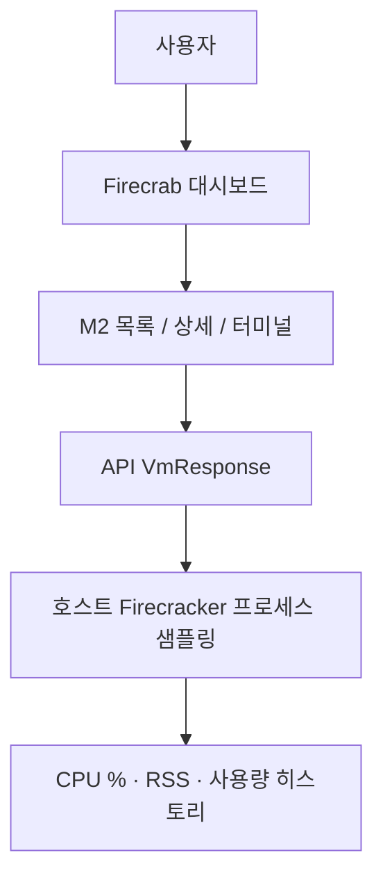

Firecrab 대시보드에서 실행 중인 M2(microVM)의 **CPU · 메모리 사용량**을 볼 수 있게 되었습니다. 할당량 옆에 실시간 사용량이 표시되고, 상세 화면과 터미널 Specs에는 짧은 그래프도 함께 나타납니다.

{/* truncate */}

## 구성 흐름

## 리소스 관측이란?

실행 상태가 `running`인 M2에 대해, 호스트에서 돌아가는 Firecracker 프로세스의 CPU 사용률과 메모리(RSS)를 주기적으로 읽어 대시보드에 보여 주는 기능입니다.

| 표시 | 의미 |
| --- | --- |
| CPU % | 호스트 Firecracker 프로세스 CPU 사용률 |
| 메모리 | 같은 프로세스의 RSS (MiB) |
| 그래프 | 최근 샘플로 그린 CPU · 메모리 스파크라인 |

게스트 안의 `free` 메모리가 아니라, **호스트 기준 프로세스 사용량**입니다. M2가 호스트에서 얼마나 부하를 주는지를 빠르게 확인하는 용도입니다.

## 왜 필요한가요?

M2를 만들고 시작하는 것만으로는, 실행 중 리소스를 얼마나 쓰는지 알기 어렵습니다. 할당 CPU · RAM만 보고 추측해야 했습니다.

최소 관측이 있으면 목록 · 상세 · 터미널에서 같은 숫자를 바로 볼 수 있습니다. 이미지 종류와 관계없이, 실행 중인 Firecracker 프로세스만 보면 되므로 운영 중 부담을 눈으로 확인하기 쉽습니다.

이번 범위는 **MVP 최소 관측**입니다. 디스크 I/O · 네트워크 대역 · 장기 보관 · 알람은 포함하지 않습니다.

## 어떻게 동작하나요?

M2가 시작되어 Firecracker 프로세스가 뜨면, API가 해당 PID의 `/proc` 정보를 샘플링합니다.

응답(`VmResponse`)에 다음 값이 채워집니다.

- `cpuUsagePercent` — CPU 사용률
- `memoryUsedMib` — RSS 메모리
- `usageHistory` — 최근 샘플 시계열 (그래프용)

대시보드는 기존처럼 약 3초마다 상태를 갱신합니다. CPU %와 그래프는 샘플이 두 번 이상 쌓인 뒤부터 안정적으로 보입니다. 프로세스가 종료되면 샘플은 비워집니다.

## 사용 방법

1. Firecrab을 설치하거나 개발 환경에서 helper · API · 대시보드를 띄웁니다.
2. M2Image · MicroNetwork를 준비한 뒤 M2를 생성하고 시작합니다.
3. 상태가 `running`이 되면 MicroVM 목록에서 cpu / ram 아래 사용량을 확인합니다.
4. M2 상세에서 할당 · 사용량과 CPU · 메모리 그래프를 봅니다.
5. 터미널을 연 뒤 하단 Specs에서 Alloc / Live 표와 그래프를 확인합니다.

터미널 Specs 예시는 다음과 같습니다.

| | Alloc | Live |
| --- | --- | --- |
| cpu | 1 | 12% |
| ram | 512 MiB | 269 MiB |
| disk | 2 GiB | — |

- **Alloc** — 생성 시 지정한 할당
- **Live** — 실행 중일 때만 보이는 호스트 프로세스 사용량
- disk의 Live 값은 이번 기능 범위에 없습니다

상단 내비게이션에는 사용량을 두지 않았습니다. Specs와 상세 화면에만 모았습니다.

## 마치며

M2를 “만들고 실행하는” 단계에서, “실행 중 호스트 부담을 확인하는” 단계로 한 걸음 옮겼습니다.

피드백과 개선 PR은 언제나 환영합니다. 기여 방법은 [기여를 환영합니다 — firecrab CONTRIBUTING 안내](/blog/contributing)를 참고해 주세요.
