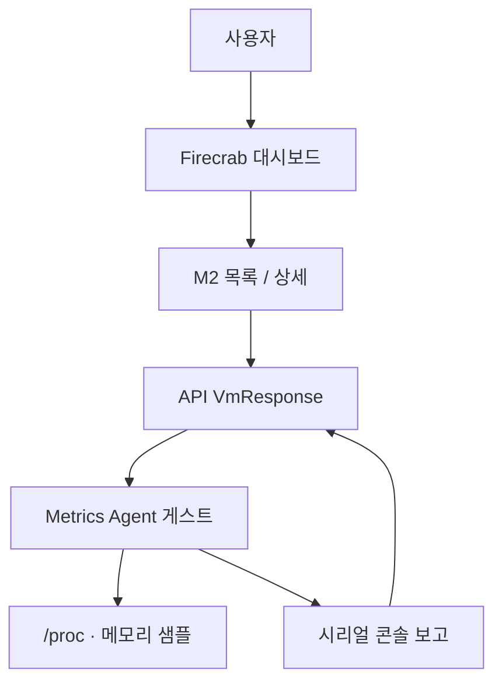

Firecrab에 **Metrics Agent**가 추가되었습니다. M2(microVM) 게스트 안에서 CPU · 메모리 사용량을 주기적으로 모아, 대시보드 목록과 상세에 그대로 보여 줍니다.

{/* truncate */}

## 구성 흐름

## Metrics Agent란?

**Metrics Agent**는 M2 게스트 OS 안에서 동작하는 Firecrab 전용 경량 에이전트입니다. M2가 시작될 때 게스트에 설치·기동되며, 호스트나 대시보드가 게스트 내부를 직접 들여다보지 않아도 사용량을 받을 수 있게 해 줍니다.

핵심 역할은 세 가지입니다.

| 역할 | 내용 |
| --- | --- |
| 수집 | 게스트 OS의 CPU busy 비율, 메모리 사용량 샘플 |
| 보고 | 약 3초마다 시리얼 콘솔로 한 줄 메트릭 전송 |
| 연동 | API가 보고를 파싱해 `VmResponse`에 채우고, 대시보드가 표시 |

Ubuntu · Rocky · Alpine 모두 **같은 Metrics Agent 경로**를 씁니다. 이미지마다 `top` · `free` 같은 도구를 따로 넣거나 SSH로 들어가 확인할 필요가 없습니다.

## 왜 필요한가요?

M2를 만들고 시작하는 것만으로는, 실행 중 게스트가 실제로 얼마나 바쁜지 알기 어렵습니다. 할당 CPU · RAM만 보고 추측해야 했습니다.

Metrics Agent가 있으면 게스트 기준 숫자를 목록과 상세에서 바로 볼 수 있습니다. 호스트 Firecracker 프로세스 RSS가 아니라, 게스트 안에서 보는 사용량에 가깝습니다.

이번 범위는 **MVP**입니다. 에이전트가 다루는 메트릭은 CPU · 메모리입니다. 디스크 I/O · 네트워크 대역 · 장기 보관 · 알람은 포함하지 않습니다.

## 어떻게 동작하나요?

1. M2가 시작되면 게스트에 Metrics Agent가 설치되고 기동됩니다.
2. 에이전트는 게스트 `/proc` 등을 읽어 CPU · 메모리를 샘플링합니다.
3. 약 3초마다 시리얼 콘솔로 사용량을 보고합니다.
4. API가 콘솔 출력을 파싱해 `VmResponse`에 넣고, 대시보드가 약 3초마다 갱신합니다.

에이전트가 아직 보고하지 않았으면 값은 비어 있습니다. 보고가 없어도 **VM 시작은 막지 않습니다.**

### 보고하는 값

| 필드 | 의미 |
| --- | --- |
| `cpuUsagePercent` | 게스트 CPU 사용률 |
| `memoryUsedMib` | 게스트 사용 메모리 (MemTotal − MemAvailable, MiB) |
| `memoryTotalMib` | 게스트 전체 메모리 (MiB) |
| `memoryUsedPercent` | 메모리 사용률 |
| `usageHistory` | 최근 샘플 시계열 (상세 그래프용) |

## 대시보드에서 보는 방법

1. Firecrab을 설치하거나 개발 환경에서 helper · API · 대시보드를 띄웁니다.
2. M2Image · MicroNetwork를 준비한 뒤 M2를 생성하고 시작합니다.
3. 상태가 `running`이 되면 MicroVM 목록에서 cpu / ram 옆 사용량을 확인합니다.
4. M2 상세에서 할당 · 사용량과 CPU · 메모리 그래프를 봅니다.

샘플이 몇 번 쌓이면 상세 화면 스파크라인이 안정적으로 보입니다.

## 마치며

Metrics Agent로 M2를 “만들고 실행하는” 단계에서, “게스트가 스스로 사용량을 보고하는” 단계로 한 걸음 옮겼습니다. 대시보드의 숫자는 그 보고를 받아 보여 주는 결과입니다.

피드백과 개선 PR은 언제나 환영합니다. 기여 방법은 [기여를 환영합니다 — firecrab CONTRIBUTING 안내](/blog/contributing)를 참고해 주세요.
