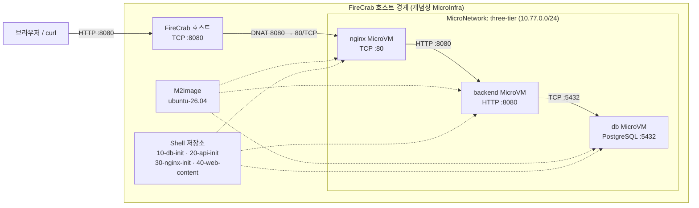

# 3티어 아키텍처 구성하기

이 튜토리얼에서는 FireCrab 대시보드에서 Ubuntu MicroVM 세 개를 만들고
**Nginx → Python API → PostgreSQL**로 이어지는 동작 가능한 3티어 서비스를 구성합니다.
마지막에는 호스트의 `8080` 포트로 웹 페이지에 접속하고, 요청이 세 계층을 모두 통과하는지 확인합니다.

:::warning[실습용 구성]

이 문서의 데이터베이스 계정과 비밀번호는 복사해서 바로 실행할 수 있도록 고정한 실습용 값입니다.
인터넷에 공개하거나 운영 환경에 적용하기 전에 반드시 비밀번호 관리, TLS, 백업, 인증을 별도로 구성하세요.

:::

## 완성할 구조



여기서 **MicroInfra**는 제품 안에서 생성하는 리소스 이름이 아니라 FireCrab이 설치된 호스트의 경계를 뜻합니다.
실제로 대시보드에서 만드는 리소스는 M2Image, MicroNetwork, Shell, MicroVM입니다.

| 경로 | 프로토콜 | 노출 범위 |
| --- | --- | --- |
| 호스트 `:8080` → Nginx `:80` | HTTP/TCP | 포트 포워딩으로 호스트에 노출 |
| Nginx → Backend `:8080` | HTTP/TCP | `three-tier` 내부 통신만 사용 |
| Backend → PostgreSQL `:5432` | PostgreSQL/TCP | `three-tier` 내부 통신만 사용 |

Backend와 DB에는 포트 포워딩을 만들지 않습니다.
세 VM이 같은 MicroNetwork에 있으므로 저장된 내부 IPv4 주소로 직접 통신할 수 있습니다.

## 준비 사항

- FireCrab이 Linux 호스트에 설치되어 있고 대시보드에 접속할 수 있어야 합니다.
- M2Image와 Ubuntu 패키지를 내려받기 위해 처음에는 인터넷 연결이 필요합니다.
- 호스트의 `8080/TCP` 포트가 비어 있어야 합니다.
- 호스트에서 최종 확인에 사용할 `curl`이 필요합니다.

설치 상태와 포트를 먼저 확인합니다.

```sh
systemctl status firecrab-net-helper firecrab-api
curl -fsS http://127.0.0.1:3000/api/host
ss -lnt | grep ':8080 ' || true
```

마지막 명령이 아무것도 출력하지 않으면 일반적으로 `8080/TCP`를 사용할 수 있습니다.
다른 프로세스나 FireCrab VM이 이미 이 포트를 사용한다면 비어 있는 호스트 포트를 선택하고 이후 URL도 함께 바꾸세요.

이 튜토리얼에서 사용할 값은 다음과 같습니다.

| 항목 | 값 |
| --- | --- |
| M2Image | `ubuntu-26.04` |
| MicroNetwork 이름 | `three-tier` |
| Subnet CIDR | `10.77.0.0/24` |
| DB 계정 / DB | `firecrab_app` / `firecrab_demo` |
| 데모 비밀번호 | `firecrab_demo_password` |
| 외부 진입점 | 호스트 `8080/TCP` |

`10.77.0.0/24`가 호스트, VPN, 컨테이너 네트워크의 기존 경로와 겹치면 충돌하지 않는 다른 사설 `/24` CIDR을 사용하세요.
CIDR을 바꾸면 DB Shell의 `PG_HBA_RULE`에도 같은 값을 사용해야 합니다.

## 1. Ubuntu M2Image 설치

1. 대시보드 왼쪽 메뉴에서 **이미지**를 엽니다.
2. **MicroRegistry**에서 `ubuntu-26.04`를 찾고 **다운로드**를 누릅니다.
3. 상태가 **패키지 준비됨**으로 바뀌면 **설치**를 누릅니다.
4. 상태가 **설치됨**인지 확인합니다.

다운로드와 설치는 별도 단계입니다.
패키지를 내려받기만 하면 MicroVM 생성 화면에 이미지가 나타나지 않습니다.

## 2. MicroNetwork 생성

1. 왼쪽 메뉴에서 **네트워크**를 엽니다.
2. 다음 값을 입력합니다.

| 필드 | 값 |
| --- | --- |
| 이름 | `three-tier` |
| Subnet CIDR | `10.77.0.0/24` |
| 인터넷 | **연결(NAT)** |

3. MicroNetwork를 생성하고 목록에서 인터넷 상태가 **연결**인지 확인합니다.

NAT는 첫 부팅 때 각 Shell이 Ubuntu 패키지를 설치하는 데 필요합니다.
프로비저닝이 끝난 뒤 Backend와 DB의 외부 통신만 차단하는 방법은 [외부 통신 차단](#선택-외부-통신-차단)에서 설명합니다.

## 3. DB 계층 구성

### 3-1. `10-db-init` Shell 생성

왼쪽 메뉴에서 **Shell**을 열고 다음 값으로 새 Shell을 만듭니다.

| 필드 | 값 |
| --- | --- |
| 이름 | `10-db-init` |
| 설명 | `PostgreSQL for the three-tier tutorial` |
| 내용 | 아래 스크립트 |

```sh
#!/bin/sh
set -eu

NETWORK_CIDR="10.77.0.0/24"
DB_NAME="firecrab_demo"
DB_USER="firecrab_app"
DB_PASSWORD="firecrab_demo_password"
export DEBIAN_FRONTEND=noninteractive

if ! dpkg-query -W -f='${Status}' postgresql 2>/dev/null | grep -q 'ok installed'; then
  apt-get update
  apt-get install -y postgresql
fi

PG_VERSION=$(find /etc/postgresql -mindepth 1 -maxdepth 1 -type d -printf '%f\n' | sort -V | tail -n 1)
PG_CONF="/etc/postgresql/$PG_VERSION/main/postgresql.conf"
PG_HBA="/etc/postgresql/$PG_VERSION/main/pg_hba.conf"

if grep -Eq '^[#[:space:]]*listen_addresses[[:space:]]*=' "$PG_CONF"; then
  sed -i "s/^[#[:space:]]*listen_addresses[[:space:]]*=.*/listen_addresses = '*'/" "$PG_CONF"
else
  printf "\nlisten_addresses = '*'\n" >>"$PG_CONF"
fi

PG_HBA_RULE="host $DB_NAME $DB_USER $NETWORK_CIDR scram-sha-256"
grep -Fqx "$PG_HBA_RULE" "$PG_HBA" || printf '%s\n' "$PG_HBA_RULE" >>"$PG_HBA"

systemctl enable --now postgresql

runuser -u postgres -- psql --set=ON_ERROR_STOP=1 \
  --set=db_user="$DB_USER" --set=db_password="$DB_PASSWORD" <<'SQL'
SELECT format('CREATE ROLE %I LOGIN PASSWORD %L', :'db_user', :'db_password')
WHERE NOT EXISTS (SELECT 1 FROM pg_roles WHERE rolname = :'db_user') \gexec
SELECT format('ALTER ROLE %I WITH LOGIN PASSWORD %L', :'db_user', :'db_password') \gexec
SQL

if ! runuser -u postgres -- psql -tAc \
  "SELECT 1 FROM pg_database WHERE datname = '$DB_NAME'" | grep -q 1; then
  runuser -u postgres -- createdb --owner="$DB_USER" "$DB_NAME"
fi

runuser -u postgres -- psql --set=ON_ERROR_STOP=1 --dbname="$DB_NAME" \
  --set=db_user="$DB_USER" <<'SQL'
CREATE TABLE IF NOT EXISTS visits (
  id BIGSERIAL PRIMARY KEY,
  visited_at TIMESTAMPTZ NOT NULL DEFAULT NOW()
);
SELECT format('GRANT SELECT, INSERT ON TABLE visits TO %I', :'db_user') \gexec
SELECT format('GRANT USAGE, SELECT ON SEQUENCE visits_id_seq TO %I', :'db_user') \gexec
SQL

systemctl restart postgresql
systemctl is-active --quiet postgresql
ss -lnt | grep ':5432 '
```

스크립트는 패키지가 없을 때만 설치하고, 역할·DB·테이블·접근 규칙은 존재 여부를 확인한 뒤 적용합니다.
따라서 VM을 다시 시작해 Shell이 재실행되어도 같은 리소스가 중복 생성되지 않습니다.

### 3-2. DB MicroVM 생성

**MicroVM** 메뉴에서 다음 값으로 VM을 생성합니다.

| 필드 | 값 |
| --- | --- |
| 이름 | `db` |
| 이미지 | `ubuntu-26.04` |
| CPU | `1` |
| RAM | `1024 MiB` |
| 디스크 | `4 GiB` |
| 저장 위치 | `default` |
| MicroNetwork | `three-tier` |
| 외부 통신 | `인터넷 허용` |
| Shell | `10-db-init` |
| 포트 포워딩 | 없음 |

생성한 `db` VM의 상세 화면을 열고 **IP** 값을 기록합니다.
이 주소를 이후 예제의 `<DB_IP>` 대신 사용합니다.
IP는 VM 생성 시 할당되어 중지와 재시작 후에도 유지됩니다.

DB VM을 시작하고 상세 로그나 터미널에서 다음 마커가 나타날 때까지 기다립니다.

```text
FIRECRAB_SHELL_OK 00.sh
FIRECRAB_SHELL_DONE ok
```

VM 상태가 `running`이어도 Shell 패키지 설치가 계속 진행 중일 수 있으므로 완료 마커까지 확인하세요.

## 4. Backend 계층 구성

### 4-1. `20-api-init` Shell 생성

다음 스크립트의 첫 부분에 있는 `<DB_IP>`를 앞 단계에서 기록한 실제 DB IP로 바꾼 뒤 Shell을 생성합니다.

| 필드 | 값 |
| --- | --- |
| 이름 | `20-api-init` |
| 설명 | `Python API connected to PostgreSQL` |
| 내용 | 아래 스크립트 |

```sh
#!/bin/sh
set -eu

DB_HOST="<DB_IP>"
DB_PORT="5432"
DB_NAME="firecrab_demo"
DB_USER="firecrab_app"
DB_PASSWORD="firecrab_demo_password"
export DEBIAN_FRONTEND=noninteractive

if ! python3 -c 'import psycopg2' >/dev/null 2>&1; then
  apt-get update
  apt-get install -y python3 python3-psycopg2
fi

if ! id -u three-tier-api >/dev/null 2>&1; then
  useradd --system --home /nonexistent --shell /usr/sbin/nologin three-tier-api
fi

install -d -m 0755 /opt/three-tier-api

cat >/opt/three-tier-api/app.py <<'PY'
import json
import os
from http.server import BaseHTTPRequestHandler, ThreadingHTTPServer

import psycopg2


def open_database():
    return psycopg2.connect(
        host=os.environ["DB_HOST"],
        port=os.environ.get("DB_PORT", "5432"),
        dbname=os.environ["DB_NAME"],
        user=os.environ["DB_USER"],
        password=os.environ["DB_PASSWORD"],
        connect_timeout=3,
    )


class Handler(BaseHTTPRequestHandler):
    def send_json(self, status, payload):
        body = json.dumps(payload).encode("utf-8")
        self.send_response(status)
        self.send_header("Content-Type", "application/json; charset=utf-8")
        self.send_header("Content-Length", str(len(body)))
        self.end_headers()
        self.wfile.write(body)

    def do_GET(self):
        try:
            if self.path == "/health":
                connection = open_database()
                try:
                    with connection.cursor() as cursor:
                        cursor.execute("SELECT current_database()")
                        database = cursor.fetchone()[0]
                finally:
                    connection.close()
                self.send_json(200, {"status": "ok", "tier": "api", "database": database})
                return

            if self.path == "/visits":
                connection = open_database()
                try:
                    with connection.cursor() as cursor:
                        cursor.execute("INSERT INTO visits DEFAULT VALUES RETURNING id")
                        visit_id = cursor.fetchone()[0]
                        cursor.execute("SELECT COUNT(*) FROM visits")
                        total = cursor.fetchone()[0]
                    connection.commit()
                finally:
                    connection.close()
                self.send_json(200, {"status": "ok", "visitId": visit_id, "totalVisits": total})
                return

            self.send_json(404, {"status": "not_found"})
        except Exception as error:
            self.send_json(503, {"status": "error", "detail": str(error)})

    def log_message(self, message_format, *args):
        print("api:", message_format % args, flush=True)


ThreadingHTTPServer(("0.0.0.0", 8080), Handler).serve_forever()
PY

cat >/etc/three-tier-api.env <<EOF
DB_HOST=$DB_HOST
DB_PORT=$DB_PORT
DB_NAME=$DB_NAME
DB_USER=$DB_USER
DB_PASSWORD=$DB_PASSWORD
EOF
chmod 0600 /etc/three-tier-api.env

cat >/etc/systemd/system/three-tier-api.service <<'UNIT'
[Unit]
Description=FireCrab three-tier tutorial API
After=network-online.target
Wants=network-online.target

[Service]
Type=simple
User=three-tier-api
EnvironmentFile=/etc/three-tier-api.env
ExecStart=/usr/bin/python3 /opt/three-tier-api/app.py
Restart=on-failure
RestartSec=2
NoNewPrivileges=true
PrivateTmp=true

[Install]
WantedBy=multi-user.target
UNIT

systemctl daemon-reload
systemctl enable --now three-tier-api
systemctl restart three-tier-api

attempt=0
until /usr/bin/python3 -c \
  'import urllib.request; urllib.request.urlopen("http://127.0.0.1:8080/health", timeout=2).read()'; do
  attempt=$((attempt + 1))
  if [ "$attempt" -ge 15 ]; then
    journalctl -u three-tier-api --no-pager -n 30
    exit 1
  fi
  sleep 2
done
```

`<DB_IP>`가 그대로 남아 있으면 API가 DB에 연결하지 못합니다.
이 Shell은 `/health`가 실제 PostgreSQL 쿼리에 성공할 때까지 확인하므로 잘못된 주소는 Shell 실패로 드러납니다.

### 4-2. Backend MicroVM 생성

| 필드 | 값 |
| --- | --- |
| 이름 | `backend` |
| 이미지 | `ubuntu-26.04` |
| CPU | `1` |
| RAM | `512 MiB` |
| 디스크 | `4 GiB` |
| 저장 위치 | `default` |
| MicroNetwork | `three-tier` |
| 외부 통신 | `인터넷 허용` |
| Shell | `20-api-init` |
| 포트 포워딩 | 없음 |

생성 후 상세 화면에서 Backend의 **IP**를 기록합니다.
이 주소를 다음 단계의 `<BACKEND_IP>`에 사용합니다.

DB의 `FIRECRAB_SHELL_DONE ok`를 확인한 다음 Backend를 시작하고 Backend에서도 같은 완료 마커를 확인합니다.

## 5. Web 계층 구성

Web 계층에는 Nginx 설정과 정적 페이지를 별도 Shell로 등록합니다.
두 Shell은 같은 `nginx` VM에 연결됩니다.

### 5-1. `30-nginx-init` Shell 생성

`<BACKEND_IP>`를 Backend 상세 화면에서 기록한 IP로 바꾸세요.

| 필드 | 값 |
| --- | --- |
| 이름 | `30-nginx-init` |
| 설명 | `Nginx reverse proxy for the Python API` |
| 내용 | 아래 스크립트 |

```sh
#!/bin/sh
set -eu

BACKEND_IP="<BACKEND_IP>"
export DEBIAN_FRONTEND=noninteractive

if ! command -v nginx >/dev/null 2>&1; then
  apt-get update
  apt-get install -y nginx
fi

install -d -m 0755 /var/www/three-tier

cat >/etc/nginx/sites-available/three-tier <<EOF
server {
    listen 80 default_server;
    server_name _;

    root /var/www/three-tier;
    index index.html;

    location /api/ {
        proxy_pass http://$BACKEND_IP:8080/;
        proxy_http_version 1.1;
        proxy_set_header Host \$host;
        proxy_set_header X-Real-IP \$remote_addr;
        proxy_set_header X-Forwarded-For \$proxy_add_x_forwarded_for;
    }

    location / {
        try_files \$uri \$uri/ /index.html;
    }
}
EOF

rm -f /etc/nginx/sites-enabled/default
ln -sfn /etc/nginx/sites-available/three-tier /etc/nginx/sites-enabled/three-tier
nginx -t
systemctl enable nginx
systemctl restart nginx
systemctl is-active --quiet nginx
```

### 5-2. `40-web-content` Shell 생성

| 필드 | 값 |
| --- | --- |
| 이름 | `40-web-content` |
| 설명 | `Static page for the three-tier tutorial` |
| 내용 | 아래 스크립트 |

```sh
#!/bin/sh
set -eu

install -d -m 0755 /var/www/three-tier

cat >/var/www/three-tier/index.html <<'HTML'
<!doctype html>
<html lang="en">
<head>
  <meta charset="utf-8">
  <meta name="viewport" content="width=device-width, initial-scale=1">
  <title>FireCrab three-tier demo</title>
  <style>
    :root { color-scheme: light; font-family: system-ui, sans-serif; }
    body { margin: 0; min-height: 100vh; display: grid; place-items: center; background: #fff7ed; color: #431407; }
    main { width: min(34rem, calc(100% - 3rem)); padding: 2rem; border: 1px solid #fdba74; border-radius: 1rem; background: white; box-shadow: 0 1rem 3rem #9a34121a; }
    h1 { margin-top: 0; }
    code { color: #c2410c; }
    button { border: 0; border-radius: .6rem; padding: .75rem 1rem; background: #ea580c; color: white; cursor: pointer; }
    #status { min-height: 1.5rem; }
  </style>
</head>
<body>
  <main>
    <p>FireCrab tutorial</p>
    <h1>Nginx → Python API → PostgreSQL</h1>
    <p id="health">Checking all three tiers…</p>
    <p id="status"></p>
    <button id="visit" type="button">Record a database visit</button>
  </main>
  <script>
    const health = document.querySelector('#health');
    const status = document.querySelector('#status');
    const button = document.querySelector('#visit');

    async function readJson(path) {
      const response = await fetch(path, { cache: 'no-store' });
      const body = await response.json();
      if (!response.ok) throw new Error(body.detail || `HTTP ${response.status}`);
      return body;
    }

    async function checkHealth() {
      try {
        const body = await readJson('/api/health');
        health.textContent = `Healthy: ${body.tier} connected to ${body.database}`;
      } catch (error) {
        health.textContent = `Health check failed: ${error.message}`;
      }
    }

    button.addEventListener('click', async () => {
      button.disabled = true;
      try {
        const body = await readJson('/api/visits');
        status.textContent = `Visit ${body.visitId} stored. Total visits: ${body.totalVisits}`;
      } catch (error) {
        status.textContent = `Request failed: ${error.message}`;
      } finally {
        button.disabled = false;
      }
    });

    checkHealth();
  </script>
</body>
</html>
HTML

chmod 0644 /var/www/three-tier/index.html
```

### 5-3. Nginx MicroVM 생성

| 필드 | 값 |
| --- | --- |
| 이름 | `nginx` |
| 이미지 | `ubuntu-26.04` |
| CPU | `1` |
| RAM | `512 MiB` |
| 디스크 | `4 GiB` |
| 저장 위치 | `default` |
| MicroNetwork | `three-tier` |
| 외부 통신 | `인터넷 허용` |
| Shell | `30-nginx-init`, `40-web-content` |
| VM 내부 포트 | `80` |
| 호스트 포트 | `8080` |
| 프로토콜 | `TCP` |

**포트 포워딩 규칙 추가**를 눌러 `VM 내부 포트 80 → 호스트 포트 8080/TCP`로 입력합니다.
이 화면은 게스트 포트를 먼저 표시하지만 실제 요청 방향은 호스트 `8080`에서 게스트 `80`입니다.

Backend의 완료 마커를 확인한 다음 Nginx VM을 시작하고 두 Shell의 성공 마커와 최종 완료 마커를 확인합니다.

```text
FIRECRAB_SHELL_OK 00.sh
FIRECRAB_SHELL_OK 01.sh
FIRECRAB_SHELL_DONE ok
```

## 6. 전체 경로 검증

FireCrab 호스트에서 다음 명령을 실행합니다.

```sh
curl -fsS http://127.0.0.1:8080/api/health
curl -fsS http://127.0.0.1:8080/api/visits
curl -I http://127.0.0.1:8080/
```

정상이라면 앞의 두 명령에서 다음과 비슷한 JSON을 받습니다.

```json
{"status": "ok", "tier": "api", "database": "firecrab_demo"}
{"status": "ok", "visitId": 1, "totalVisits": 1}
```

브라우저에서 `http://127.0.0.1:8080/`을 열고 **Record a database visit** 버튼을 누릅니다.
다른 PC에서 접속한다면 `127.0.0.1` 대신 FireCrab 호스트의 IP를 사용하고 호스트 방화벽에서도 `8080/TCP`를 허용해야 합니다.

이 검증은 다음 전체 경로가 정상임을 보여 줍니다.

1. 포트 포워딩이 호스트 `8080` 요청을 Nginx `80`으로 전달합니다.
2. Nginx가 `/api/` 요청을 Backend 내부 IP의 `8080`으로 프록시합니다.
3. Python API가 DB 내부 IP의 PostgreSQL `5432`에 기록하고 결과를 반환합니다.

## 선택: 외부 통신 차단

초기 패키지 설치가 끝난 Backend와 DB는 인터넷 접근 없이 같은 MicroNetwork 안에서 계속 통신할 수 있습니다.

각 VM에 대해 다음 순서로 변경합니다.

1. Backend 또는 DB를 중지합니다.
2. 상세 화면에서 **수정**을 누릅니다.
3. **외부 통신**을 `격리(게이트웨이만 허용)`로 바꾸고 저장합니다.
4. DB를 먼저 시작하고 완료를 확인한 다음 Backend를 시작합니다.

튜토리얼 Shell은 필요한 패키지가 이미 설치되어 있으면 `apt-get`을 건너뛰므로 격리 상태의 재시작에도 동작합니다.
이 튜토리얼에서는 내부 계층 보호에 집중하기 위해 Nginx의 외부 통신 설정은 변경하지 않습니다.

## 문제 해결

### `ubuntu-26.04`가 VM 생성 화면에 없음

이미지 메뉴에서 다운로드만 끝내고 설치하지 않았는지 확인하세요.
MicroRegistry 상태가 **설치됨**이어야 합니다.

### Shell이 실패함

VM 상세 로그나 터미널에서 `FIRECRAB_SHELL_FAILED` 바로 앞의 출력을 확인합니다.
첫 부팅이라면 MicroNetwork와 VM의 외부 통신이 모두 인터넷 허용인지 확인하세요.
VM 상태가 `running`인 것만으로 Shell 완료를 판단하지 말고 `FIRECRAB_SHELL_DONE ok`를 기다리세요.

### Nginx에서 `502 Bad Gateway`가 반환됨

- `30-nginx-init`의 `BACKEND_IP`가 Backend 상세 화면의 IP와 같은지 확인합니다.
- 세 VM이 모두 `three-tier` MicroNetwork를 사용하는지 확인합니다.
- Backend 로그에서 `three-tier-api`가 시작되었고 Shell이 성공했는지 확인합니다.
- DB Shell이 끝나기 전에 Backend를 시작하지 않았는지 확인합니다.

### `/api/health`가 `503`을 반환함

`20-api-init`의 `DB_HOST`와 DB 상세 화면의 IP를 비교합니다.
Subnet CIDR을 바꿨다면 `10-db-init`의 `NETWORK_CIDR`도 같은 CIDR로 바꿨는지 확인하세요.

### `8080/TCP` 포트가 이미 사용 중임

호스트 포트와 프로토콜 조합은 한 VM만 사용할 수 있습니다.
기존 프로세스나 다른 VM의 규칙을 제거하거나 `8081`처럼 비어 있는 호스트 포트를 선택하고 검증 URL도 같은 포트로 바꾸세요.

### Shell을 수정했지만 기존 VM에 반영되지 않음

VM은 연결 당시 Shell의 최신 버전을 고정해서 사용합니다.
Shell에서 **새 버전 게시**만 해서는 기존 VM의 고정 버전이 바뀌지 않습니다.

1. 대상 VM을 중지합니다.
2. VM 상세 화면에서 **수정**을 누릅니다.
3. Shell 선택을 해제했다가 다시 선택해 최신 버전으로 재연결하고 저장합니다.
4. VM을 다시 시작하고 완료 마커를 확인합니다.

## 정리

실습 리소스는 참조 관계의 역순으로 정리합니다.

1. `nginx`, `backend`, `db` 순서로 VM을 중지하고 삭제합니다.
2. `10-db-init`, `20-api-init`, `30-nginx-init`, `40-web-content` Shell을 삭제합니다.
3. `three-tier` MicroNetwork를 삭제합니다.
4. 다른 VM에서 사용하지 않을 때만 `ubuntu-26.04` M2Image를 삭제합니다.

VM이 연결된 MicroNetwork나 VM에 고정된 Shell은 먼저 삭제할 수 없습니다.
