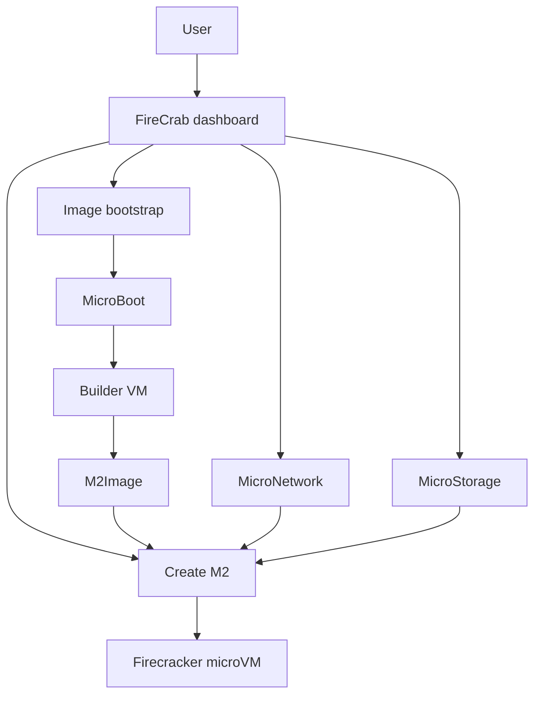

FireCrab now includes **M2**. M2 is the virtual machine unit managed by FireCrab and lets you create
and operate AWS Firecracker-based microVMs.

{/* truncate */}

## Configuration flow

## What is M2?

M2 is short for **MicroMachine**. It is also referred to as a VM in FireCrab and provides an
independent computing environment for applications and services.

Each M2 is created from the selected M2Image, CPU, memory, disk, and MicroNetwork configuration.

## Why is M2 needed?

Conventional virtual machines provide an independent operating system and resources, but some
operating environments need a lighter and simpler execution unit.

M2 creates and runs VMs with Firecracker microVMs. Within FireCrab, you can combine an image,
network, and storage location to construct the execution environment you need.

## How does it work?

When you create an M2, FireCrab prepares a dedicated rootfs from the selected M2Image and applies
the CPU, memory, disk, and network configuration.

Starting the VM launches a Firecracker process and assigns an IP address through MicroNetwork. The
dashboard displays its status and startup progress, and a running M2 can be accessed through its
serial console.

## How to use it

1. Prepare an M2Image.
2. Create the MicroNetwork that will be connected to the VM.
3. In the dashboard, enter the VM name and select its image, CPU, memory, disk, and network.
4. Start the M2.
5. Check its status and open the terminal when console access is needed.

An M2 can be created, started, stopped, and deleted. You can also select a MicroStorage location to
place its disk on a particular host disk.
