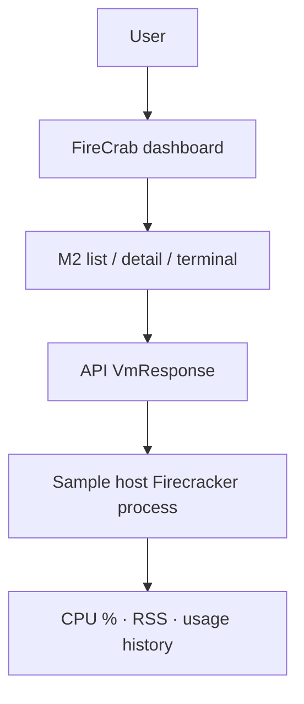

FireCrab dashboards can now show **CPU and memory usage** for running M2 (microVM) instances.
Live usage appears next to the allocated amounts, and short graphs show up in the detail view and
terminal Specs panel.

{/* truncate */}

## Configuration flow

## What is resource metrics?

For M2 instances in the `running` state, FireCrab periodically reads CPU utilization and memory
(RSS) from the host Firecracker process and surfaces those values in the dashboard.

| Display | Meaning |
| --- | --- |
| CPU % | Host Firecracker process CPU utilization |
| Memory | RSS of the same process (MiB) |
| Graph | CPU and memory sparklines from recent samples |

This is **host process usage**, not guest `free` memory. It is meant for a quick check of how much
load an M2 places on the host.

## Why is it needed?

Creating and starting an M2 did not reveal how much resource it was using while running. Operators
had to guess from the allocated CPU and RAM alone.

With minimal metrics, the same numbers are available from the list, detail, and terminal views.
Regardless of guest image, only the running Firecracker process is sampled, so operational load is
easy to see at a glance.

This release is **MVP minimal metrics**. Disk I/O, network bandwidth, long-term retention, and
alerts are out of scope.

## How does it work?

When an M2 starts and its Firecracker process is up, the API samples that PID via `/proc`.

The following fields are filled on `VmResponse`:

- `cpuUsagePercent` — CPU utilization
- `memoryUsedMib` — RSS memory
- `usageHistory` — recent time series for graphs

The dashboard still refreshes about every three seconds. CPU % and graphs become stable after at
least two samples. Samples are cleared when the process exits.

## How to use it

1. Install FireCrab, or run the helper, API, and dashboard in a development environment.
2. Prepare an M2Image and MicroNetwork, then create and start an M2.
3. When the state is `running`, check usage under cpu / ram in the MicroVM list.
4. Open M2 detail for allocation, usage, and CPU · memory graphs.
5. Open Terminal and use the Specs panel at the bottom for Alloc / Live tables and graphs.

Example terminal Specs:

| | Alloc | Live |
| --- | --- | --- |
| cpu | 1 | 12% |
| ram | 512 MiB | 269 MiB |
| disk | 2 GiB | — |

- **Alloc** — amounts chosen at create time
- **Live** — host process usage, only while running
- Live disk is out of scope for this feature

Usage is not shown in the top navigation. It lives only in Specs and detail views.

## Closing

FireCrab moves one step from “create and run an M2” to “see the host cost while it runs.”

Feedback and improvement PRs are always welcome. See
[Contributions welcome — firecrab CONTRIBUTING guide](/en/blog/contributing) for how to join in.
