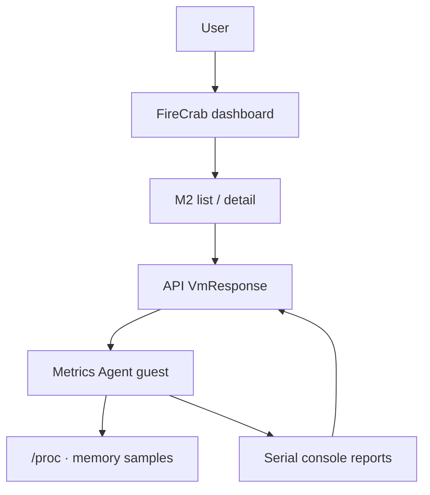

FireCrab now includes **Metrics Agent**. It runs inside each M2 (microVM) guest, samples CPU and
memory usage on a short interval, and surfaces those numbers in the dashboard list and detail views.

{/* truncate */}

## Configuration flow

## What is Metrics Agent?

**Metrics Agent** is a lightweight FireCrab agent that runs inside the M2 guest OS. It is installed
and started when the M2 boots, so the host and dashboard can receive usage without inspecting the
guest directly.

It has three core jobs:

| Role | What it does |
| --- | --- |
| Collect | Sample guest OS CPU busy ratio and memory usage |
| Report | Send a one-line metric over the serial console about every three seconds |
| Integrate | API parses reports into `VmResponse`; the dashboard renders them |

Ubuntu, Rocky, and Alpine all use the **same Metrics Agent path**. You do not need a different
in-guest tool per image, or an SSH session just to read load.

## Why is it needed?

Creating and starting an M2 did not reveal how busy the guest really was. Operators had to guess
from allocated CPU and RAM alone.

With Metrics Agent, guest-side numbers show up in the list and detail views. These values are close
to what you would see inside the guest — not the host Firecracker process RSS.

This release is **MVP**. The agent covers CPU and memory only. Disk I/O, network bandwidth,
long-term retention, and alerts are out of scope.

## How does it work?

1. When an M2 starts, Metrics Agent is installed and started in the guest.
2. The agent samples CPU and memory from guest `/proc` and related sources.
3. About every three seconds it reports usage over the serial console.
4. The API parses console output into `VmResponse`, and the dashboard refreshes about every three
   seconds.

If the agent has not reported yet, the fields stay empty. Missing reports **do not block VM start**.

### Reported fields

| Field | Meaning |
| --- | --- |
| `cpuUsagePercent` | Guest CPU utilization |
| `memoryUsedMib` | Guest used memory (MemTotal − MemAvailable, MiB) |
| `memoryTotalMib` | Guest total memory (MiB) |
| `memoryUsedPercent` | Memory usage percent |
| `usageHistory` | Recent time series for detail graphs |

## How to see it in the dashboard

1. Install FireCrab, or run the helper, API, and dashboard in a development environment.
2. Prepare an M2Image and MicroNetwork, then create and start an M2.
3. When the state is `running`, check usage next to cpu / ram in the MicroVM list.
4. Open M2 detail for allocation, usage, and CPU · memory graphs.

Graphs stabilize after a few samples accumulate.

## Closing

With Metrics Agent, FireCrab moves from “create and run an M2” to “the guest reports its own
usage.” Dashboard numbers are the result of those reports.

Feedback and improvement PRs are always welcome. See
[Contributions welcome — firecrab CONTRIBUTING guide](/en/blog/contributing) for how to join in.
